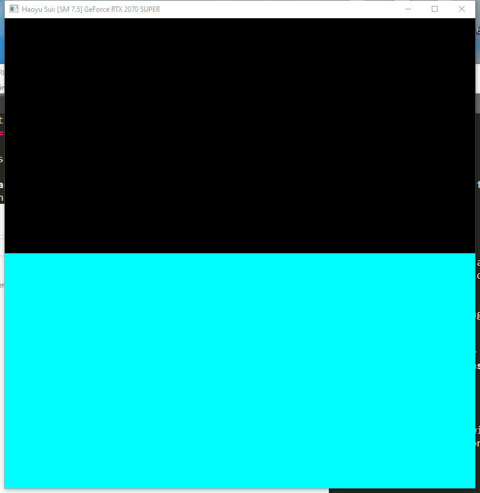
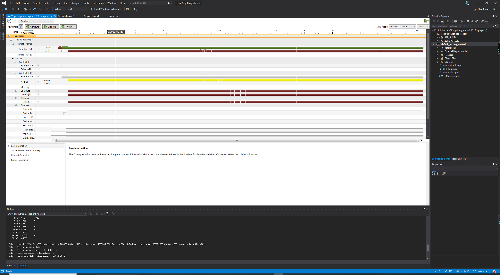
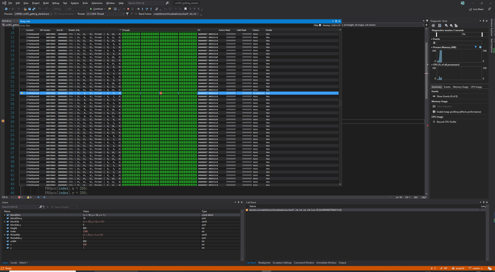
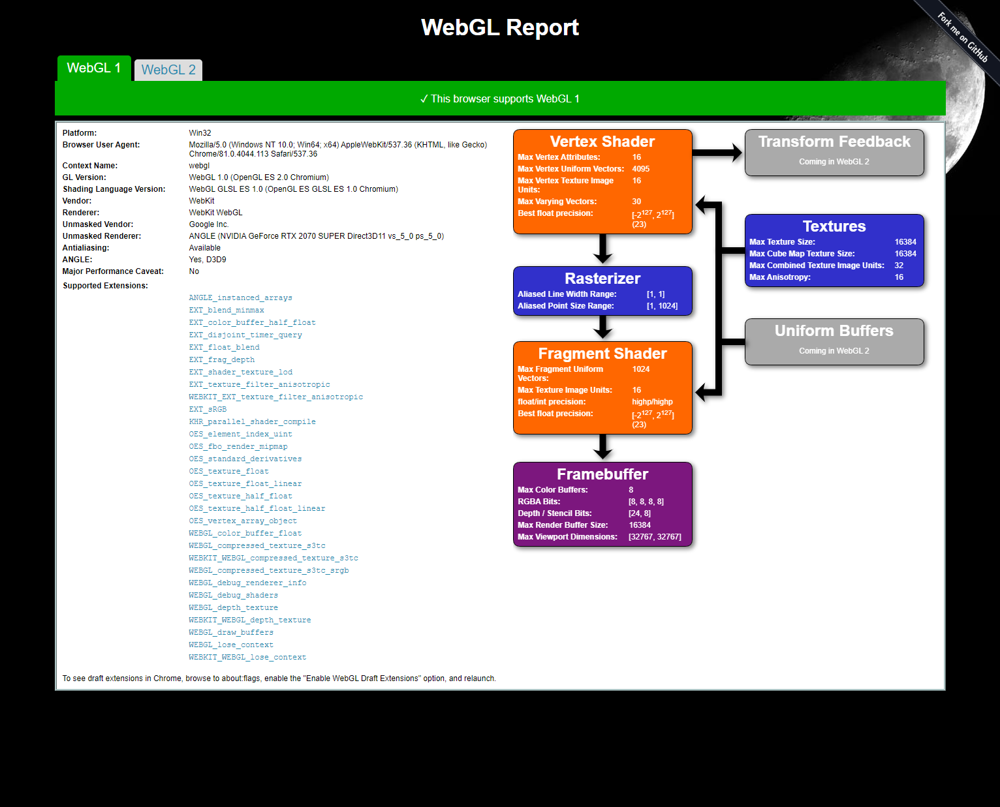
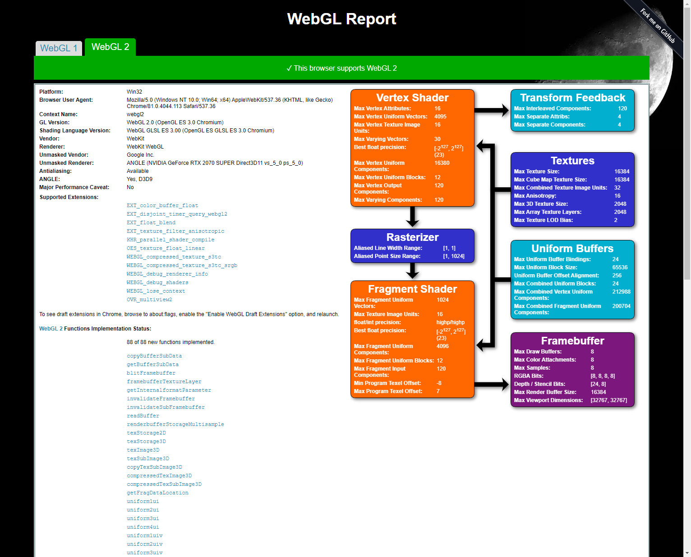
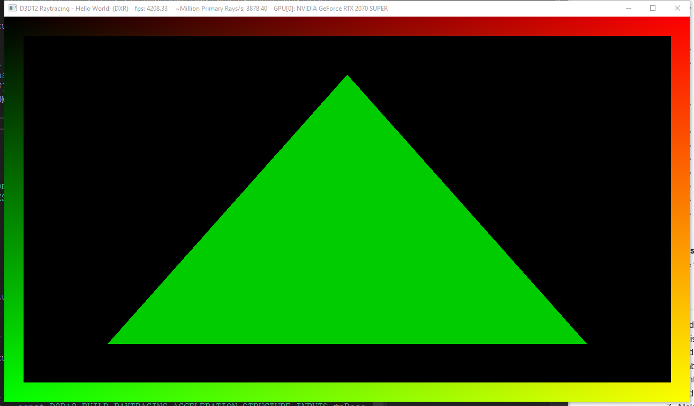

Project 0 Getting Started
====================

**University of Pennsylvania, CIS 565: GPU Programming and Architecture, Project 0**

* Haoyu Sui
  	* [LinkedIn](http://linkedin.com/in/haoyu-sui-721284192)
* Tested on: Windows 10, i5-9600K @ 3.70GHz 16GB, RTX 2070 SUPER 8GB 
* SM：7.5

### My results:

#### First CUDA Test

#### Analyze

#### Nsight Debugging

#### WebGL Test

#### DXR Test
