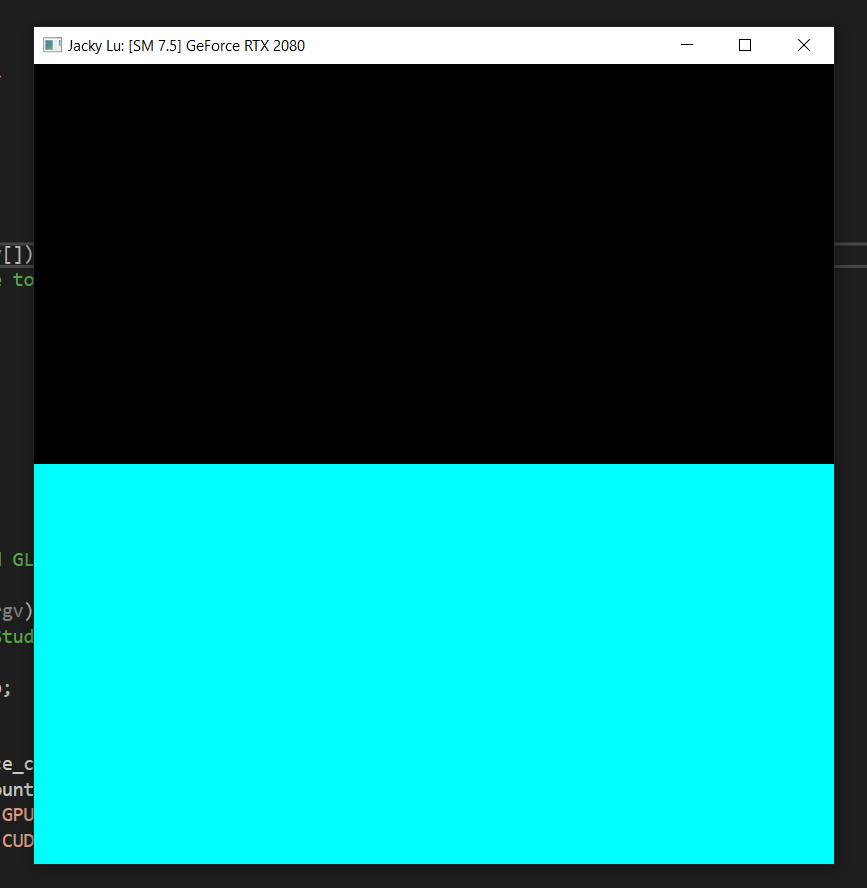
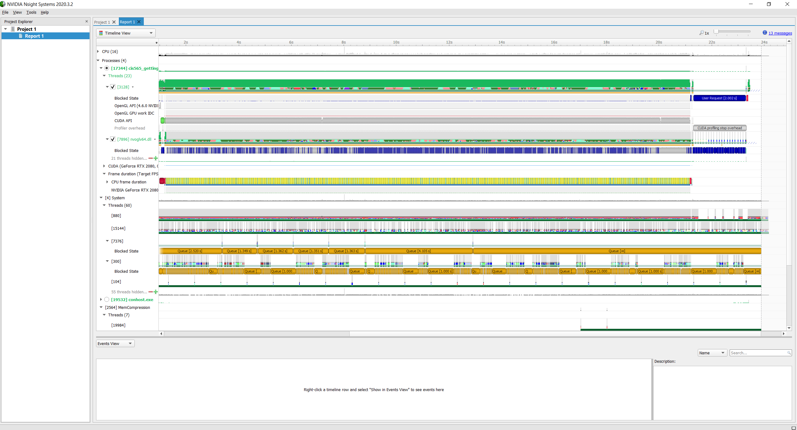

Project 0 Getting Started
====================

**University of Pennsylvania, CIS 565: GPU Programming and Architecture, Project 0**

* Jacky Lu
  * (TODO) [LinkedIn](https://www.linkedin.com/in/jacky-lu-506968129/), [personal website](), [twitter](), etc.
* Tested on: Windows 10 Education, i9-9900k @ 3.60GHz 64GB, NVIDIA GeForce RTX 2080 8192MB (Personal)

### (TODO: Your README)

Include screenshots, analysis, etc. (Remember, this is public, so don't put
anything here that you don't want to share with the world.)

# Compute Capability
* ### Compute Capability of my CUDA-compatible GPU (GeForce RTX 2080): 7.5

# Result:
* ### Screenshot from Part 3.1.1

* ### Screenshot of the timeline from Part 3.1.2's Nsight System's performance analysis
