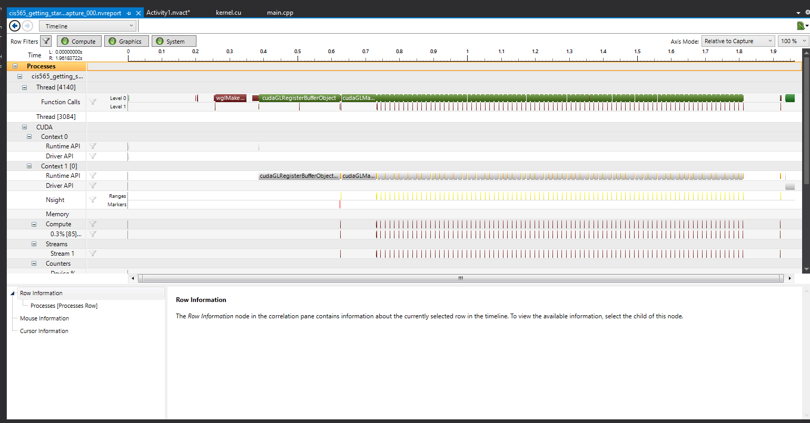
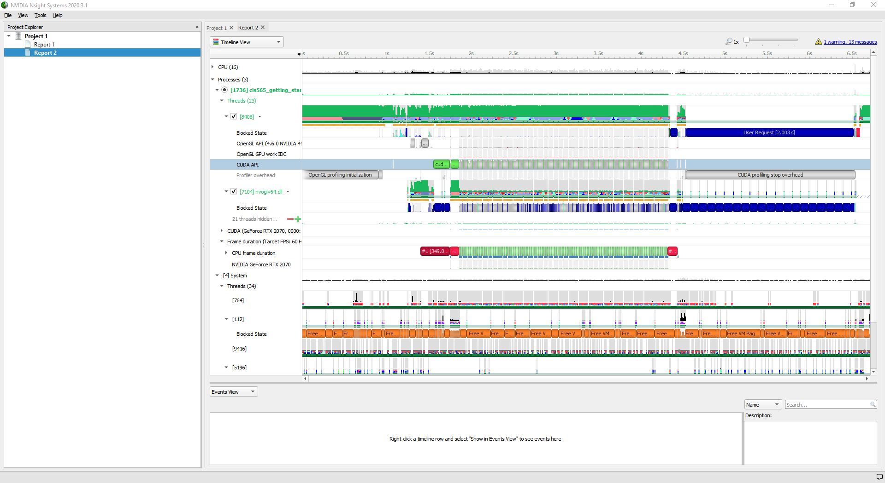
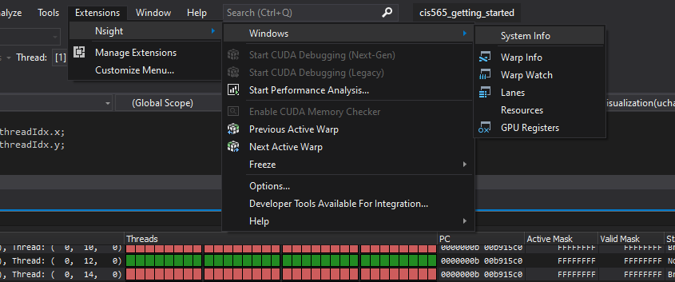
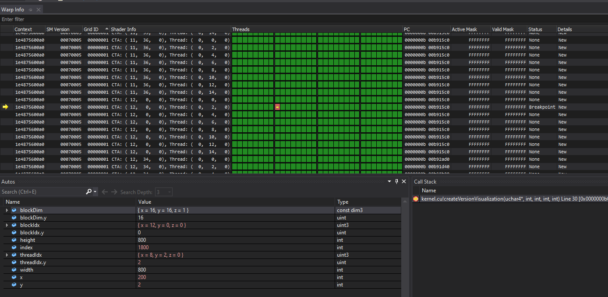
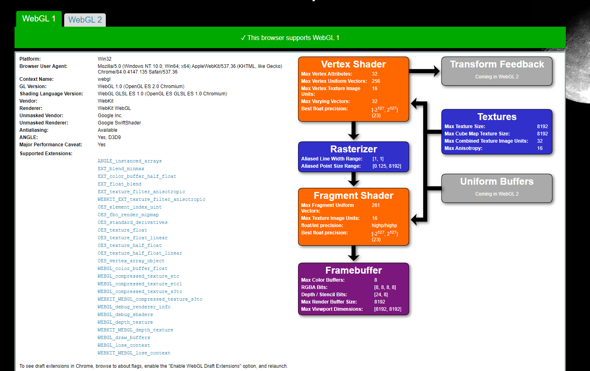
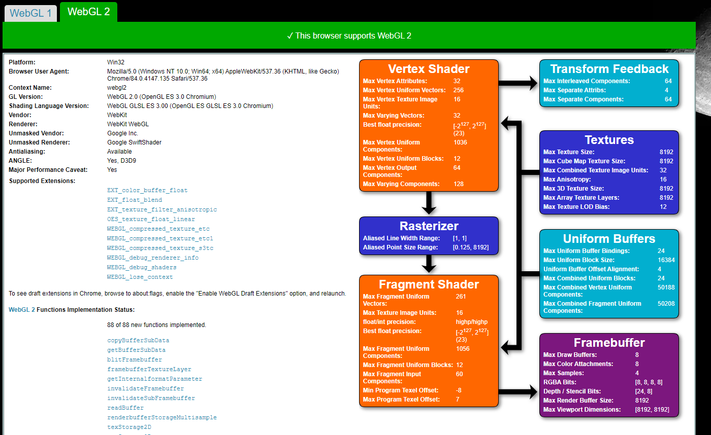
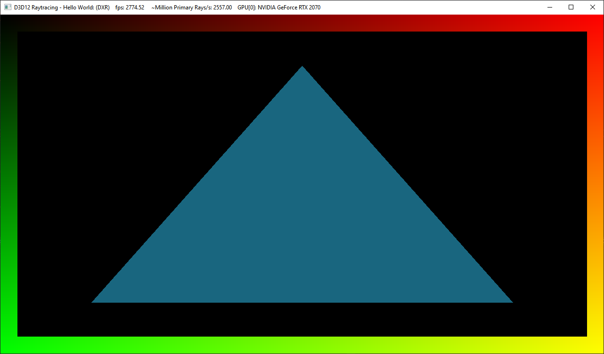

Project 0 Getting Started
====================

**University of Pennsylvania, CIS 565: GPU Programming and Architecture, Project 0**

* Peter Gagliardi
  * [personal website](https://ptrgags.dev/), [twitter](https://twitter.com/ptrgags)
* Tested on: Windows 10 Home 10.0.18362 Build 18362, AMD Ryzen 7 2700 
    @ 3.20 GHz 32GB, Nvidia GeForce RTX 2070 8192MB (Personal desktop)

### README

#### 3.1 CUDA

In this first section of the lab, I was getting the `nvcc` error 
`unsupported gpu architecture compute_30` when I used the suggested
`cmake-gui ..` command to configure the project. I tried again, this time using
the `cmake ..` command I have used in the past. This time, it only enables
`compute_75` capabilities. 

##### 3.1.1 Modify the program

Here is a screenshot of the modified program with my name:

##### 3.1.2 Analyze the program

**EDIT** On Piazza,
[a classmate posted](https://piazza.com/class/ke6j08dgmpt7lu?cid=11) a Visual
Studio configuration setting that fixes the timeline crash. So I am able to use
the plugin too if needed.

**Note** I learned that the Nsight Performance Analysis plugin does not
work with recent GPUs like my RTX 2070 card. I tried the standalone Nsight
Systems tool. See 
[my Piazza note](https://piazza.com/class/ke6j08dgmpt7lu?cid=7) for more
information.

This separate program provides the required timeline feature:

##### 3.1.3 Nsight Debugging

**NOTE** For this section, I noticed that there were two CUDA Debugging options.
I picked the Next-Gen version since the legacy version would crash the debugger.

I was able to complete this section, though the menu options had a slightly
different layout than in the instructions.

I hope _Warp Info_ is the correct window to open. Here's a screenshot:

This section did work correctly in Visual Studio, though it looks like the
menu options are named slightly differently:

#### 3.2 WebGL

Since the instructions do not clarify which version of WebGL will be used
in the course, I'm including both WebGL 1 and WebGL 2 support

#### 3.3 DXR

Since I have an RTX 270 card, I am able to use DXR even without the
fallback layer.

