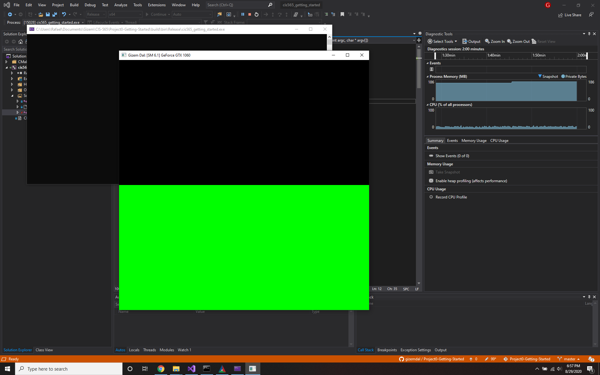
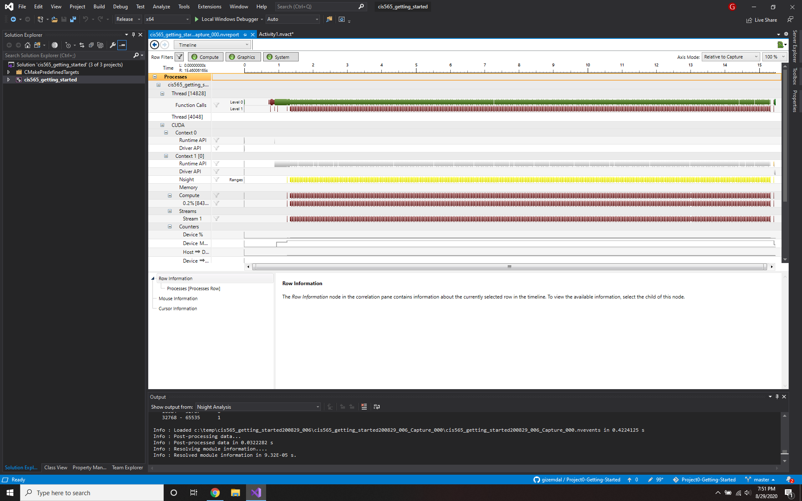
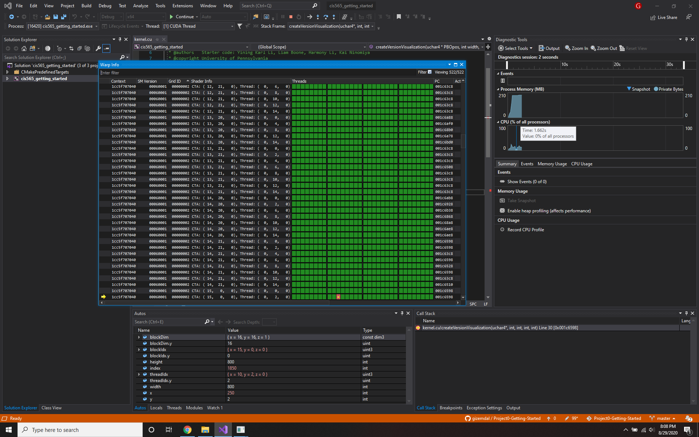
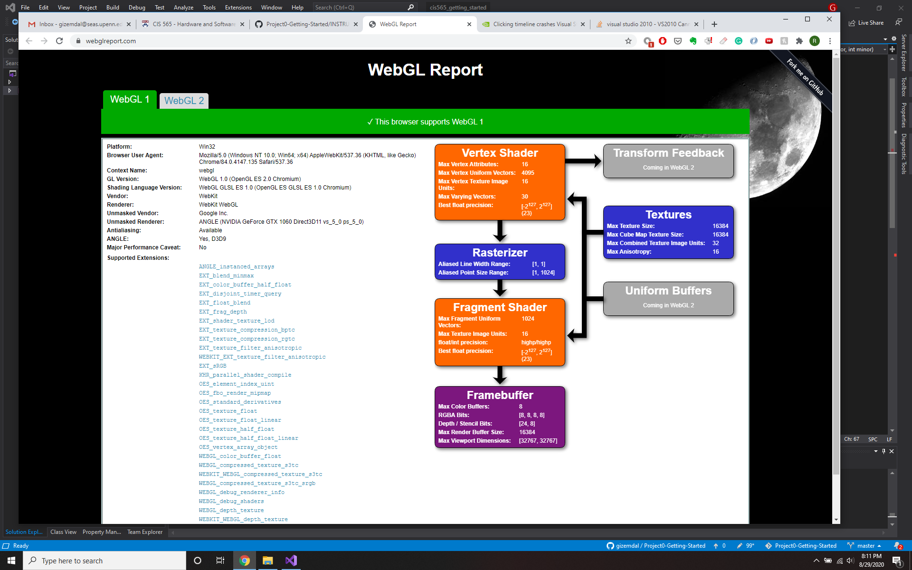
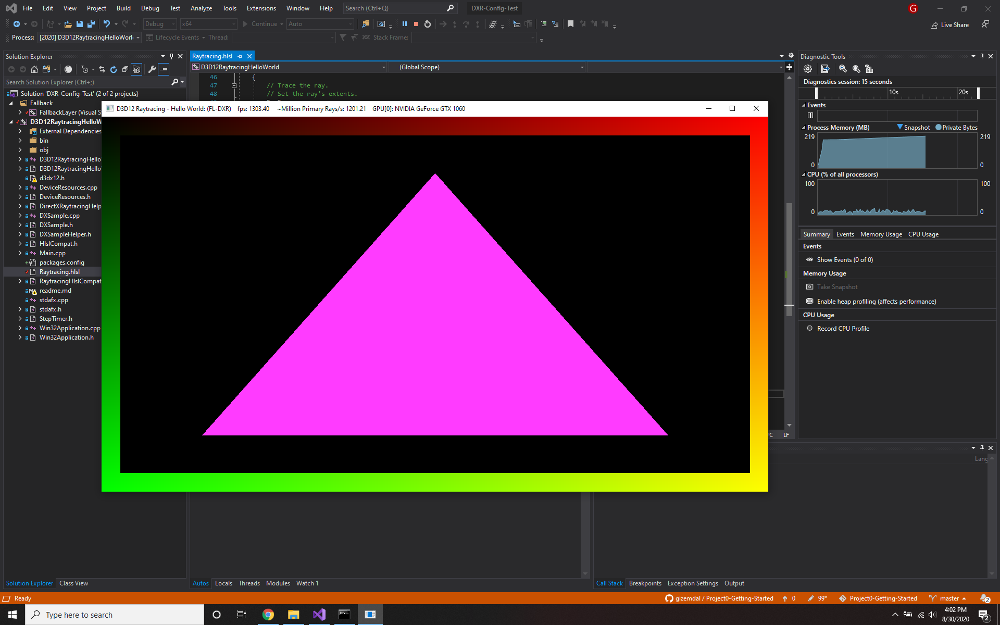

Project 0 Getting Started
====================

**University of Pennsylvania, CIS 565: GPU Programming and Architecture, Project 0**

* Gizem Dal
  * [LinkedIn](https://www.linkedin.com/in/gizemdal), [personal website](https://www.gizemdal.com/)
* Tested on: Predator G3-571 Intel(R) Core(TM) i7-7700HQ CPU @ 2.80 GHz 2.81 GHz - Personal computer (borrowed my friend's computer for the semester)

### Screenshots

