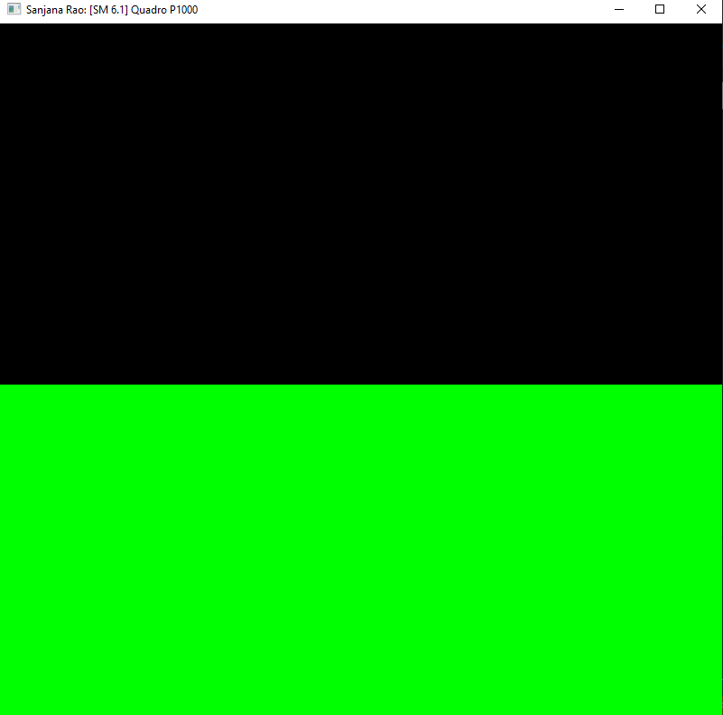
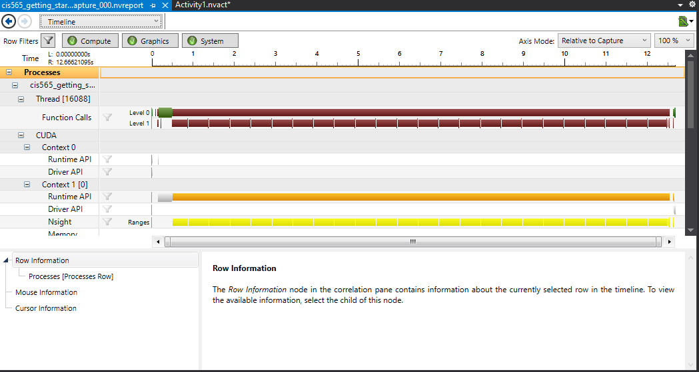
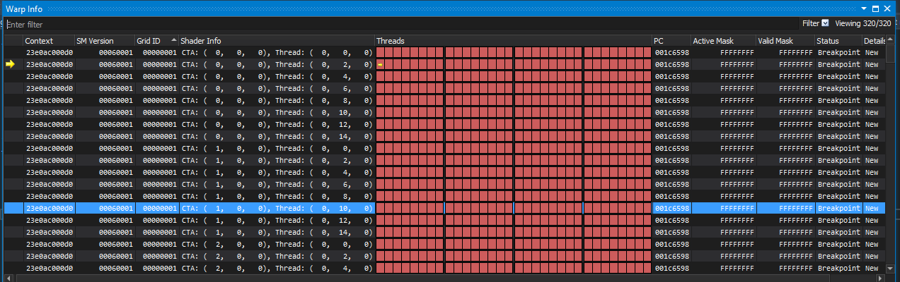
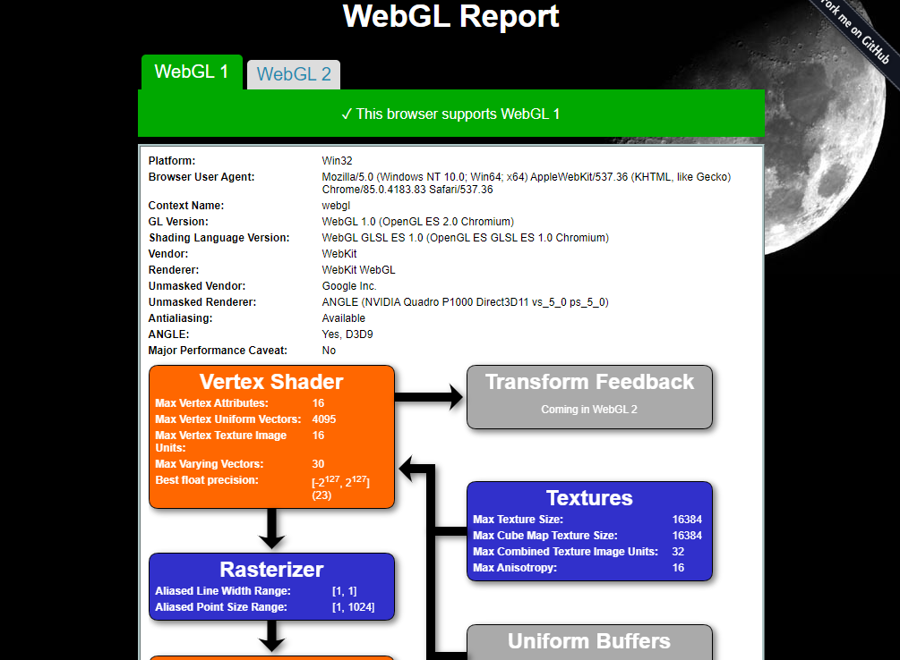

Project 0 Getting Started
====================

**University of Pennsylvania, CIS 565: GPU Programming and Architecture, Project 0**

* Sanjana Rao
  * https://www.linkedin.com/in/sanjanaxrao/
  * https://www.sanjanaxrao.com/
* Tested on: GTX 222 222MB (CETS Virtual Lab)

### README

Quadro P1000: Compute Capacilty = 6.1

Part 3.1.1: Modify the CUDA Project and Take a Screenshot

Part 3.1.2: Analyze

Part 3.1.3: Nsight Debugging

Part 3.2: WebGL

Part 3.3: DXR
Can't do because using CETS Virtual Labs
