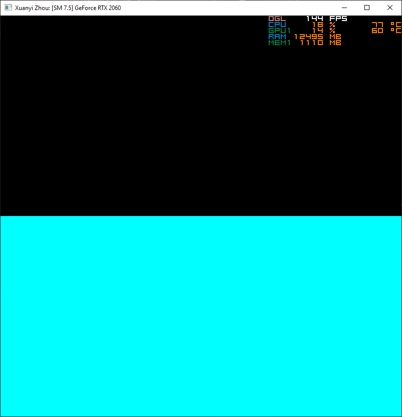
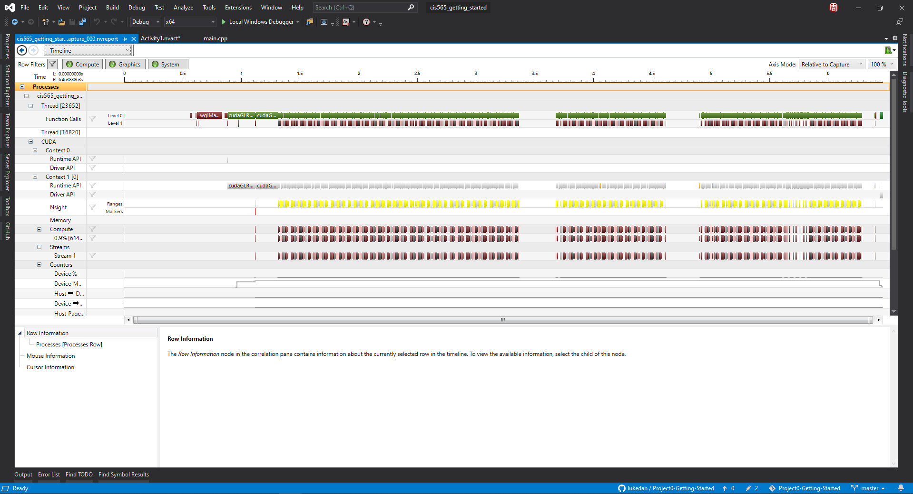
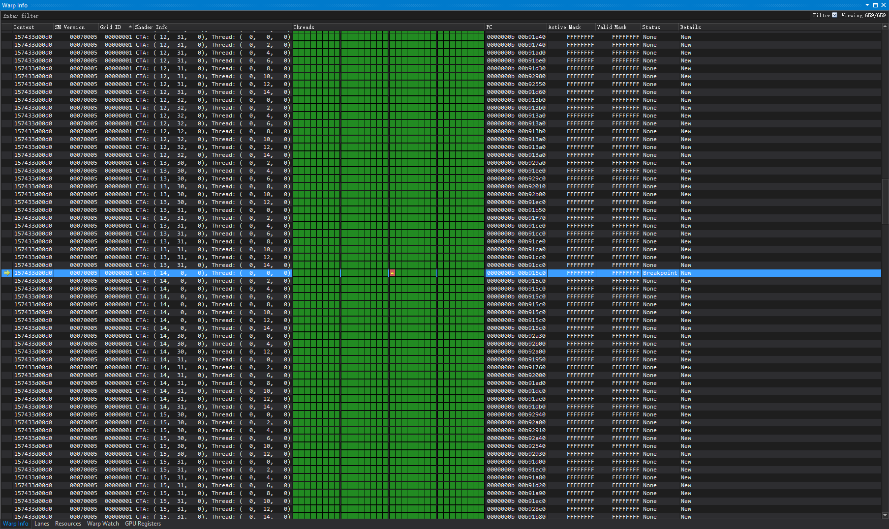
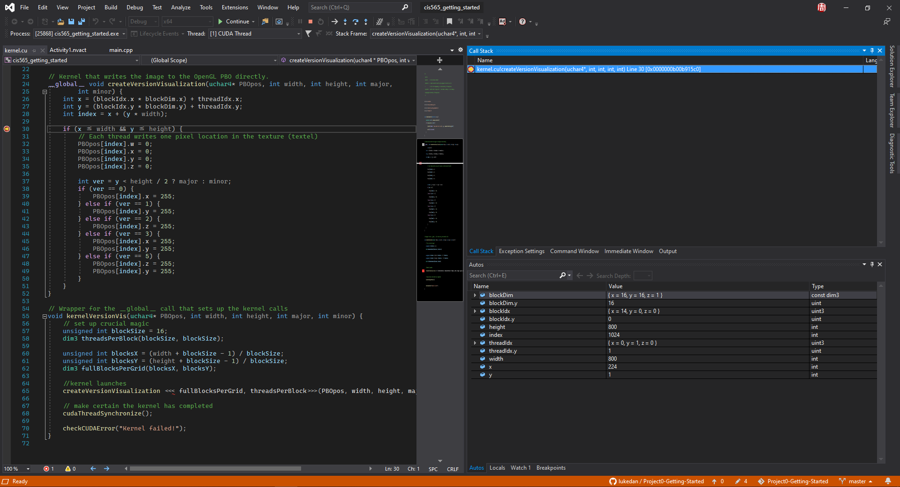

Project 0 Getting Started
====================

**University of Pennsylvania, CIS 565: GPU Programming and Architecture, Project 0**

* Xuanyi Zhou
  * [LinkedIn](https://www.linkedin.com/in/xuanyi-zhou-661365192/)
  * [Github](https://github.com/lukedan)
* Tested on: Windows 10, i7-9750H @ 2.60GHz 32GB, RTX 2060 6GB, personal laptop

## CUDA Test

## CUDA Trace

## CUDA Debugging

- Since my graphics card is not supported by the legacy debugger, therer's no 'CUDA Info' window. Here's a screenshot of the 'Warp Info' window instead.

## WebGL

## DXR

- At first the program kept crashing due to objects being in invalid states. I investigated it for a while and discovered that having the RivaTuner Statistics Server running causes it (you can see it in the 'CUDA Test' screenshot).

