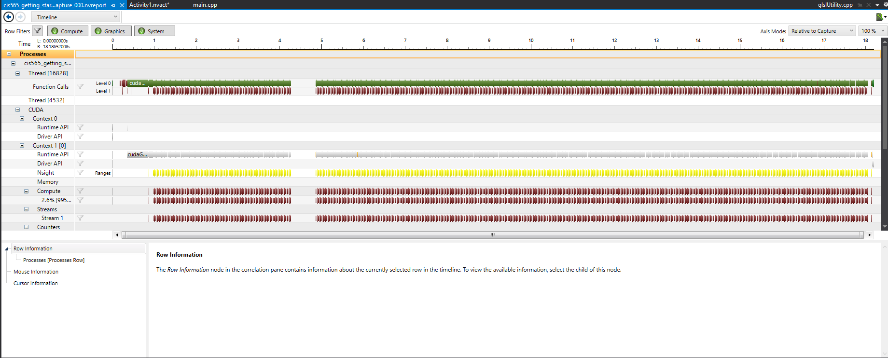
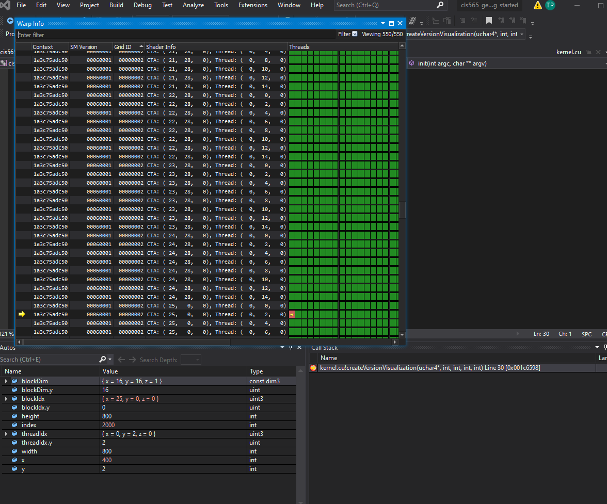
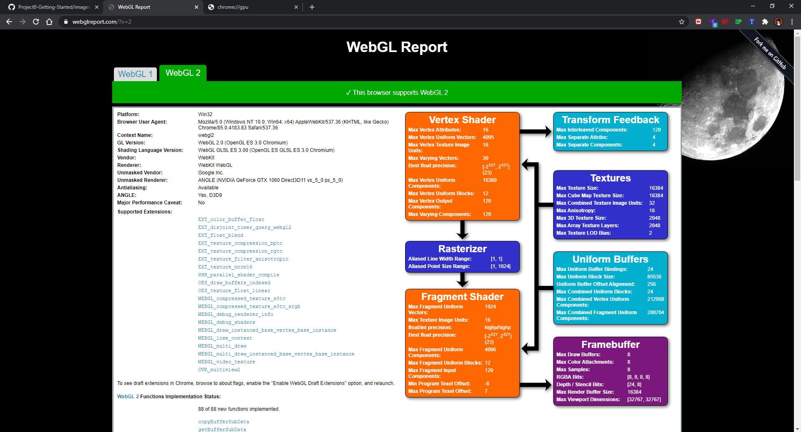
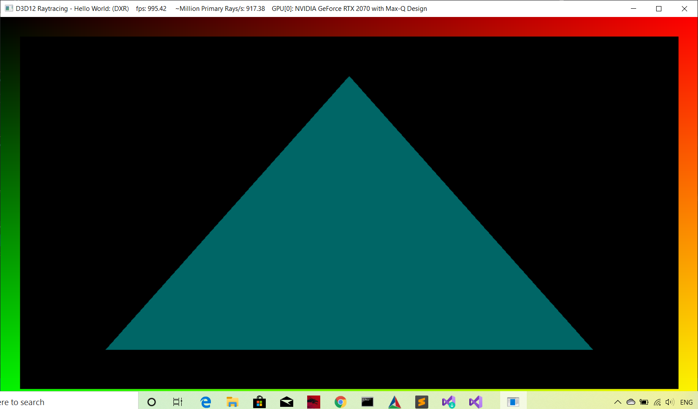

Project 0 Getting Started
====================

**University of Pennsylvania, CIS 565: GPU Programming and Architecture, Project 0**

* Tushar Purang
  
  * [Linkedin](https://www.linkedin.com/in/tpurang/)
  
  * [Portfolio](http://tushvr.com/)
  
  * [Youtube Channel](https://www.youtube.com/channel/UC9ZTxWcJjCSAJDC54dPNbKw?view_as=subscriber)
  
* Tested on: Windows 10, i7-7700HQ @ 2.80GHz 16GB, GTX 1060 6GB (Personal laptop)

### CUDA TEST

### CUDA TRACE

### CUDA Debugging

### WebGL

### 

### DXR

