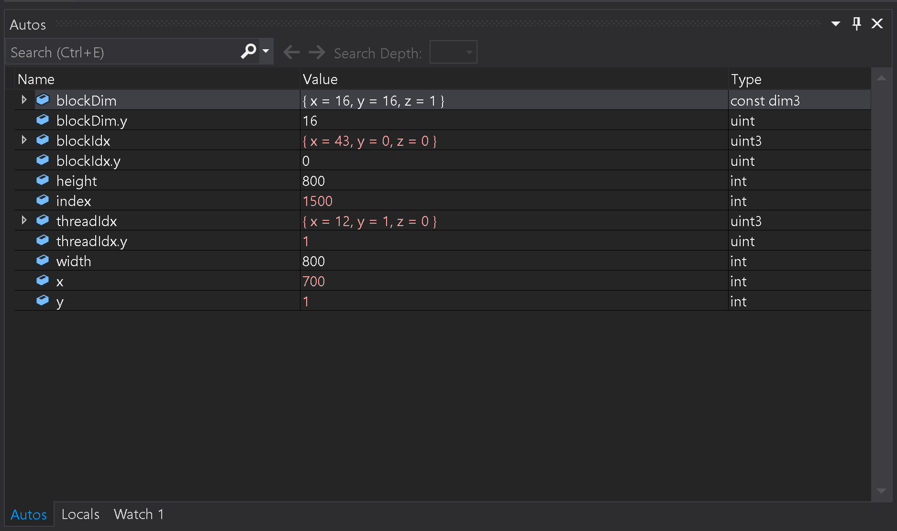
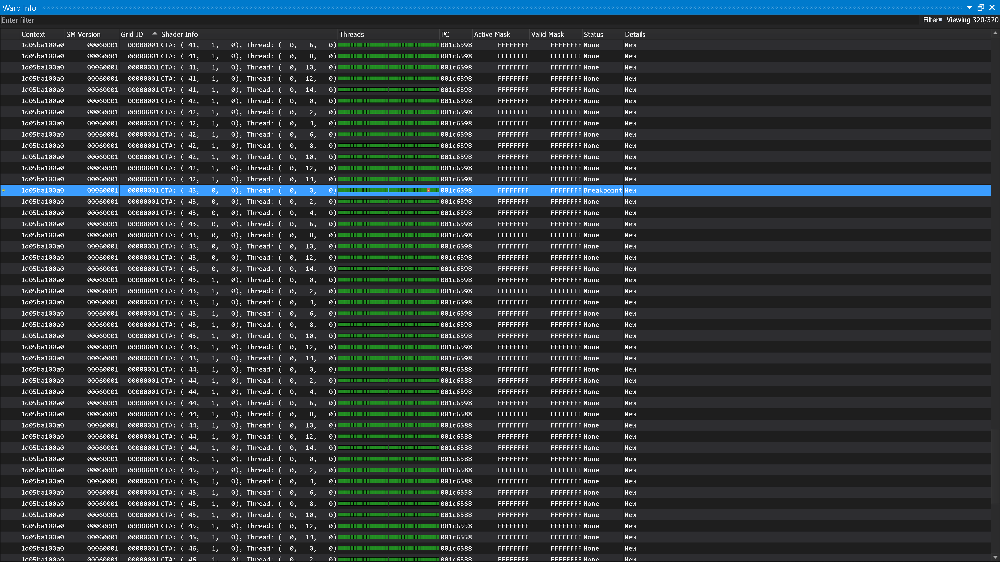

Project 0 Getting Started
====================

**University of Pennsylvania, CIS 565: GPU Programming and Architecture, Project 0**

* Hanyu Liu
  * [personal website](http://liuhanyu.net/) 
* Tested on: Windows 10, Intel(R) Core(TM) i7-7700HQ CPU @ 2.80GHz 16.0GB, GeForce GTX 1050 (Personal)

### Compute Capability

GeForce GTX 1050: 6.1

### Section 3.1.1

### Section 3.1.2

### Section 3.1.3 Autos

### Section 3.1.3 Warp

### Section 3.2

### Section 3.3
I do not have a DXR compatible GPU unfortunately ):

