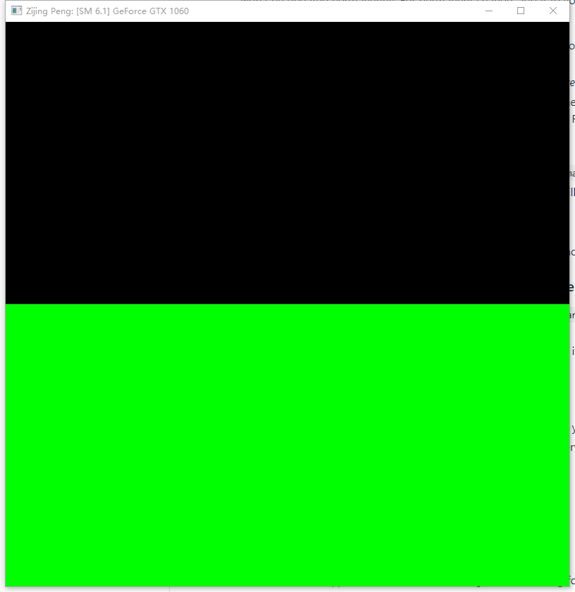
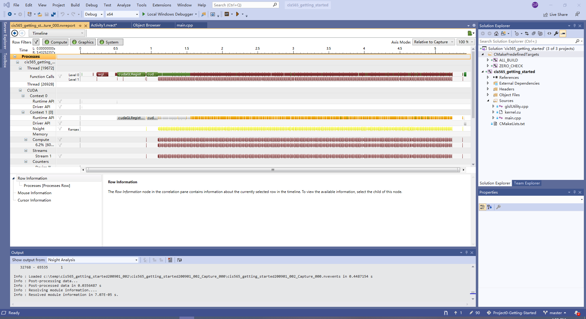
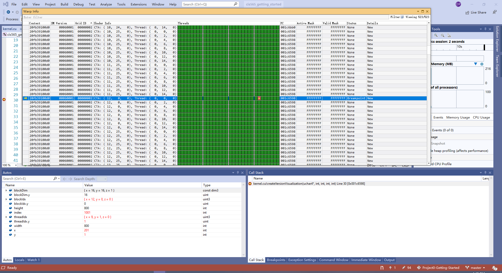
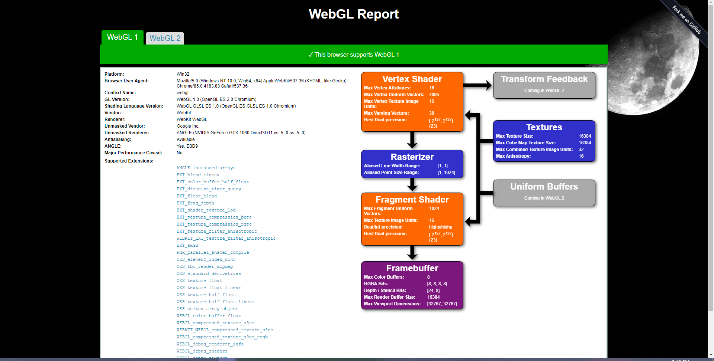
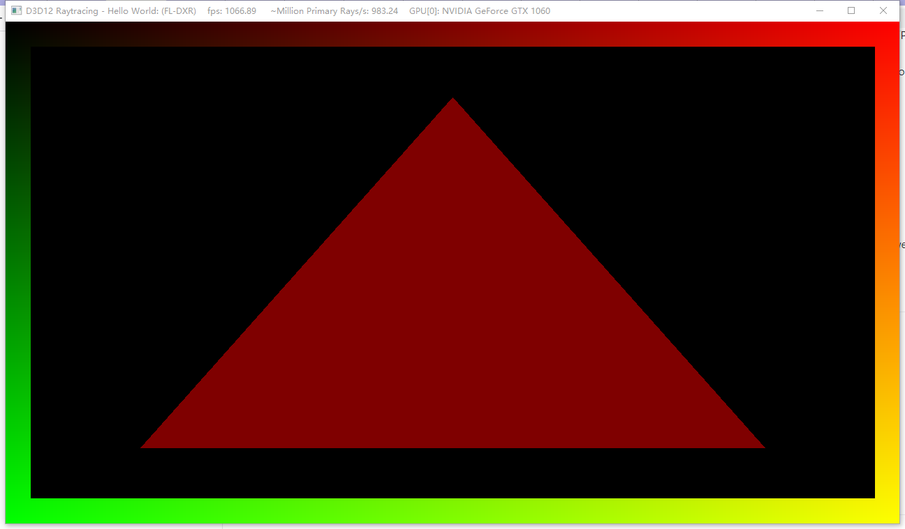

Project 0 Getting Started
====================

**University of Pennsylvania, CIS 565: GPU Programming and Architecture, Project 0**

* Zijing Peng
  * [LinkedIn](https://www.linkedin.com/in/zijing-peng/)
  * [personal website](https://zijingpeng.github.io/)
* Tested on: Windows 22, i7-8750H@ 2.22GHz 16GB, NVIDIA GeForce GTX 1060

### Screenshots

