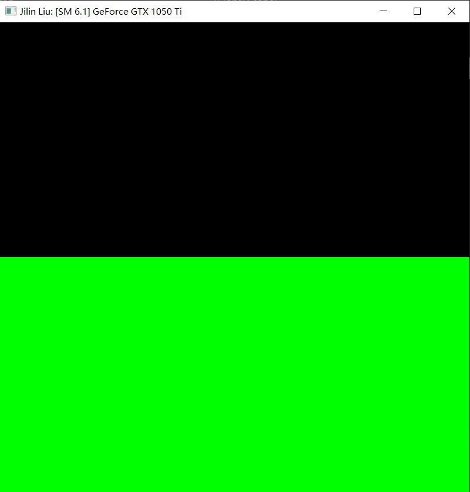
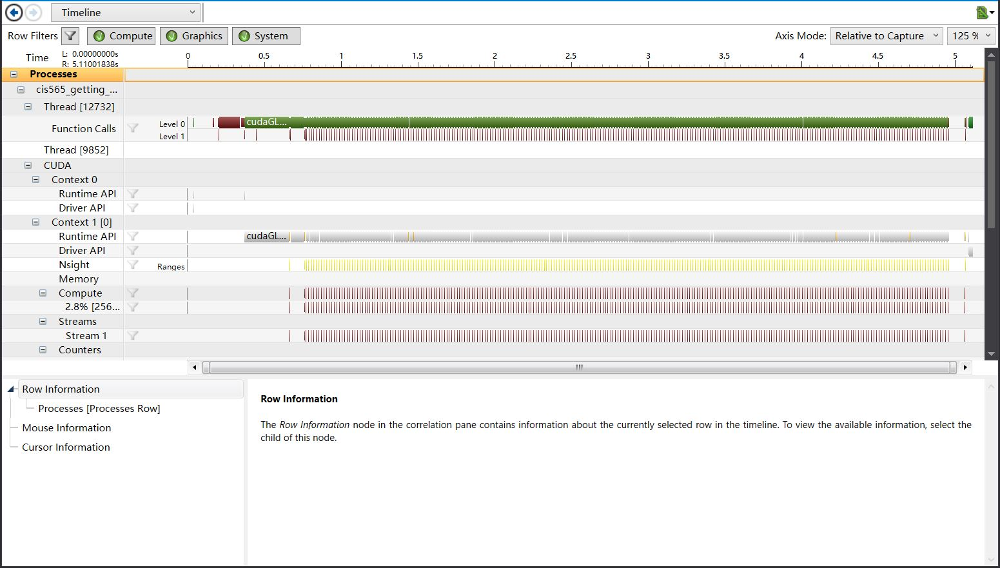
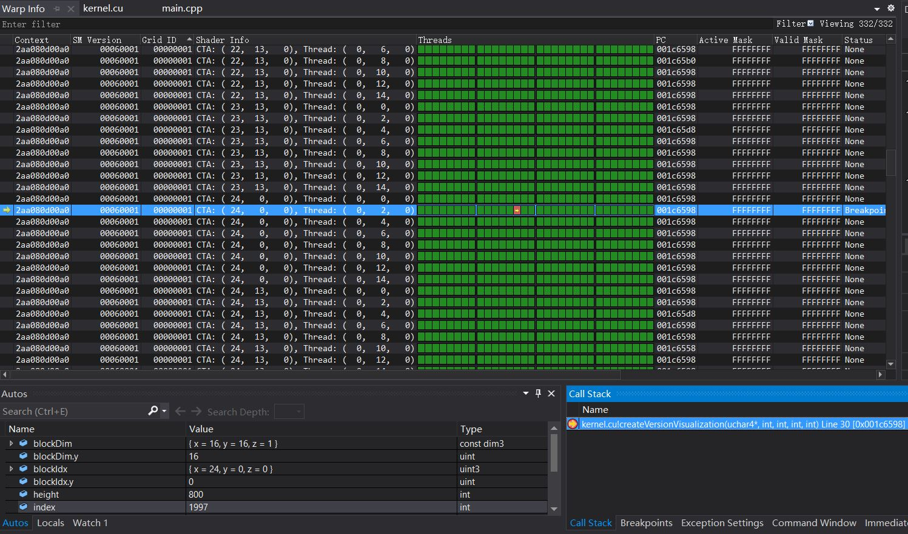
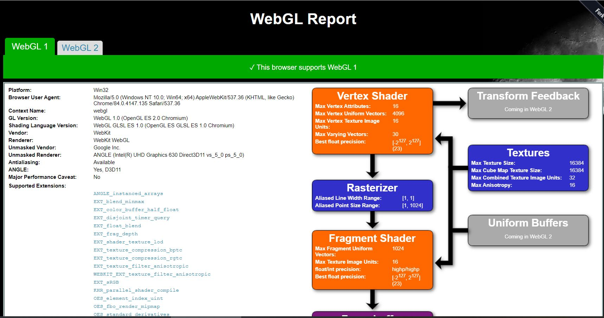
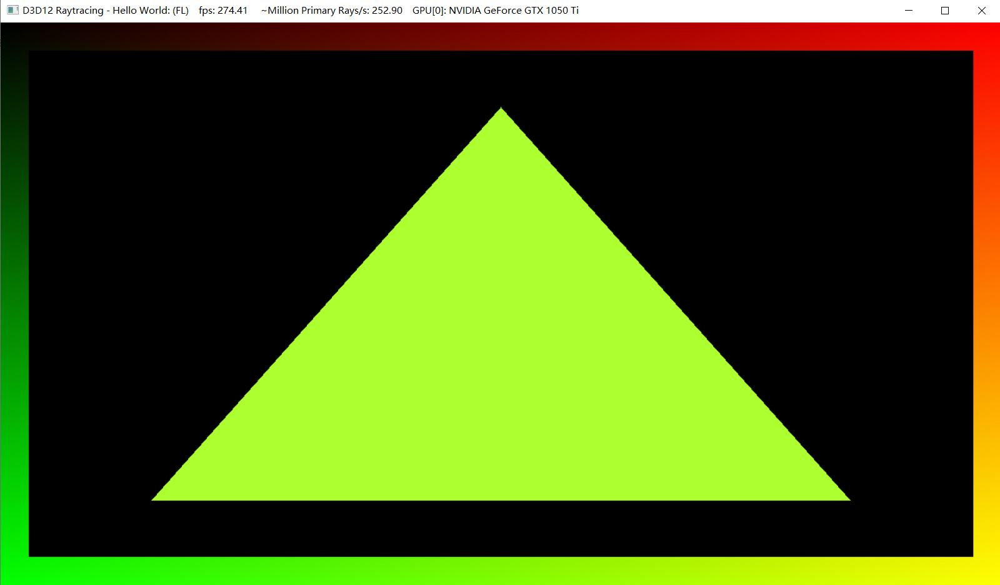

Project 0 Getting Started
====================

**University of Pennsylvania, CIS 565: GPU Programming and Architecture, Project 0**

* Jilin Liu
  * [LinkedIn](https://www.linkedin.com/in/jilin-liu-61b273192/), [twitter](https://twitter.com/Jilin18043110).
* Tested on: Windows 10, i7-8750H @ 2.20GHz, 16GB, GTX 1050Ti 4096MB (personal)

### Test Result

