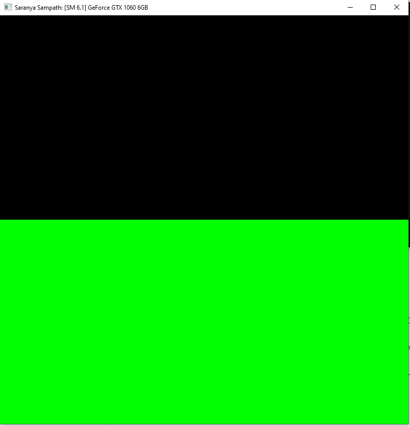
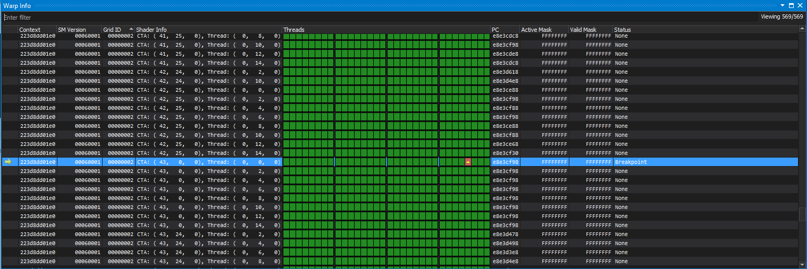
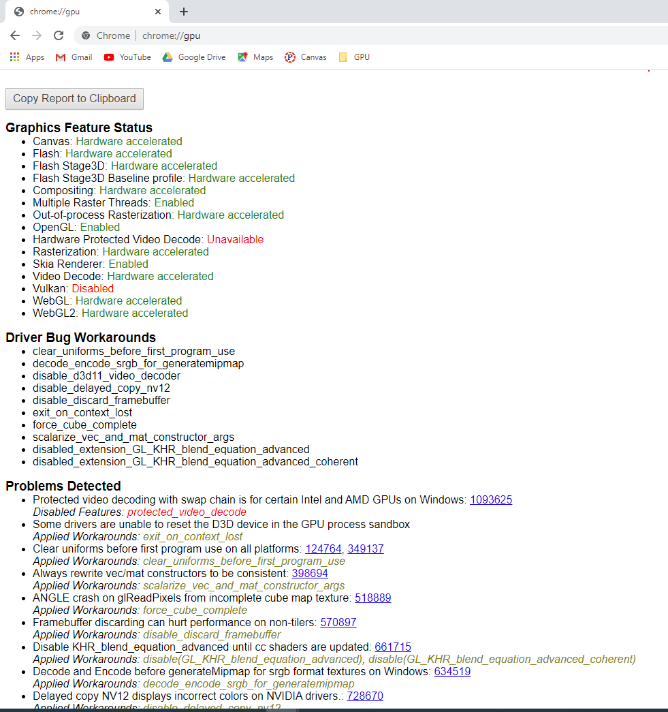
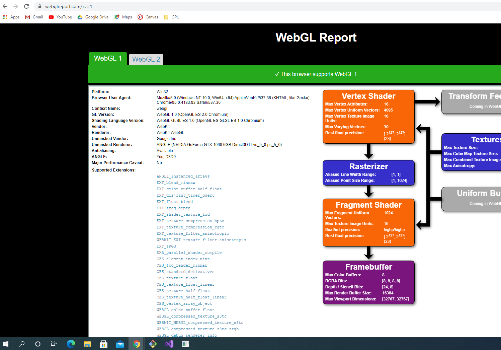
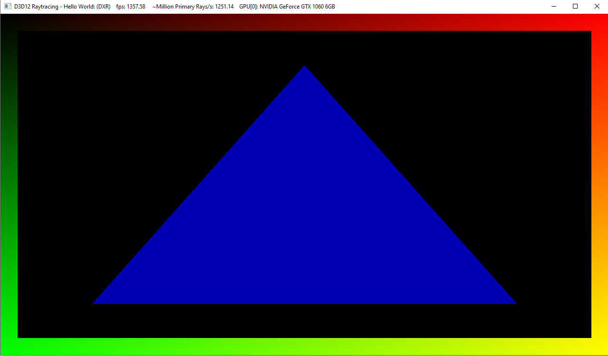

Project 0 Getting Started
====================

**University of Pennsylvania, CIS 565: GPU Programming and Architecture, Project 0**

* Saranya Sampath
  * [LinkedIn](https://www.linkedin.com/in/saranya-sampath), [personal website](https://www.saranyasampath.com/), etc.
* Tested on: Windows 10 Pro, i7-8700 @ 3.20 GHz 64.0 GB, GTX 1060 6GB (Personal Computer) 

### Saranya's ReadMe 

Include screenshots, analysis, etc. (Remember, this is public, so don't put
anything here that you don't want to share with the world.)

Here is the screenshots that I took during this assignment. 

(Part 3.1.1) This is the screenshot of the green and black window with my name on the top after I changed that in the main.cpp code: 

(Part 3.1.2) This is the screenshot of the timeline analysis using Nsight:

 

(Part 3.1.3) This is a screenshot of debugging using Nsight:

(Part 3.2) Here are screenshots of the WebGL testing: 

(3.3) Here is a screenshot of the triangle that renders. I am using DXR mode here, and I modified the triangle to be blue. 

