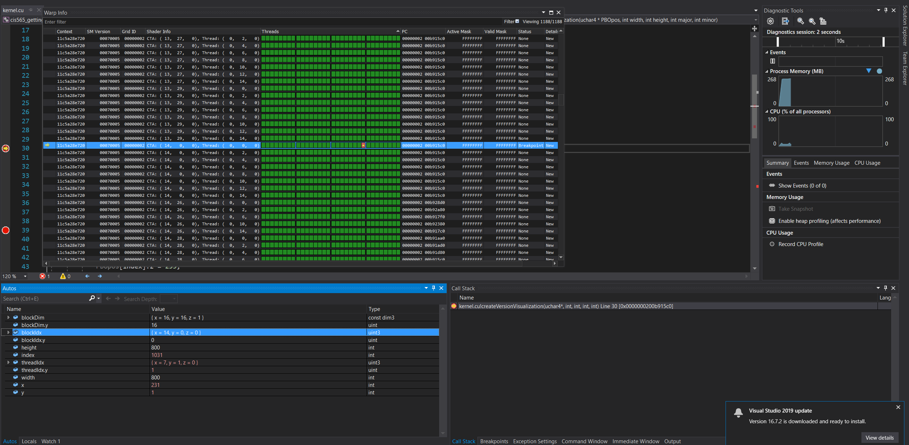
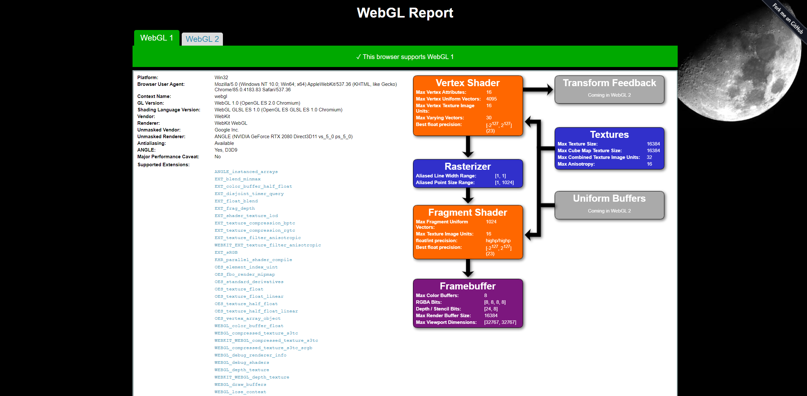
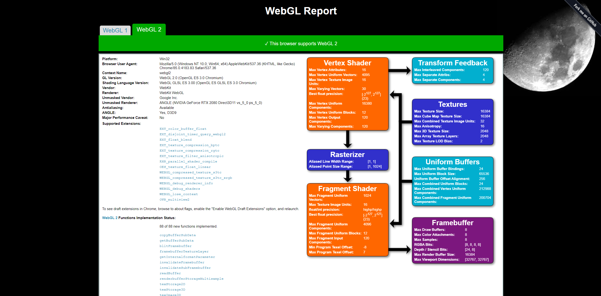
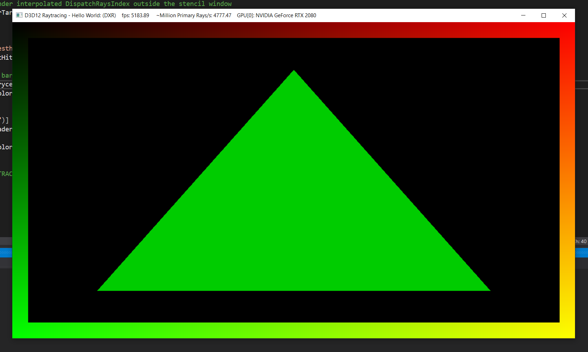
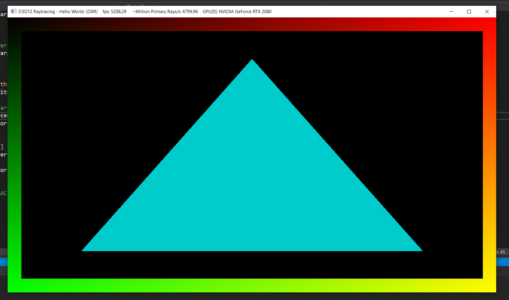

Project 0 Getting Started
====================

**University of Pennsylvania, CIS 565: GPU Programming and Architecture, Project 0**

* Jacky Lu
  * [LinkedIn](https://www.linkedin.com/in/jacky-lu-506968129/)
* Tested on: Windows 10 Education, i9-9900k @ 3.60GHz 64GB, NVIDIA GeForce RTX 2080 8192MB (Personal)

# README

## Compute Capability
* ### Compute Capability of my CUDA-compatible GPU (GeForce RTX 2080): 7.5

## Result:
* ### Screenshot from Part 3.1.1

* ### Screenshot of the timeline from Part 3.1.2's Nsight System's performance analysis

* ### Screenshot of the Autos window and the Warp Info from Part 3.1.3's Nsight debugging

* ### Screenshots of WebGL 1 and WebGL 2 support from Part 3.2
* ##### WebGL 1

* ##### WebGL 2

* ### Screenshot from Part 3.2 (`float3 barycentrics = float3(0, 0.8, 0);`)

* ### Screenshot from Part 3.2 (`float3 barycentrics = float3(0, 0.8, 0.8);`)
