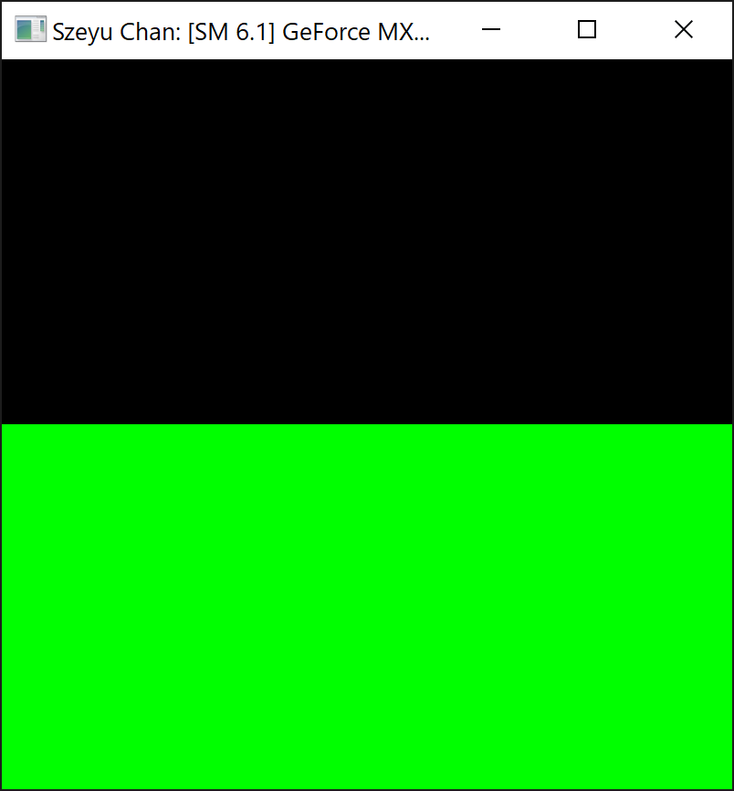
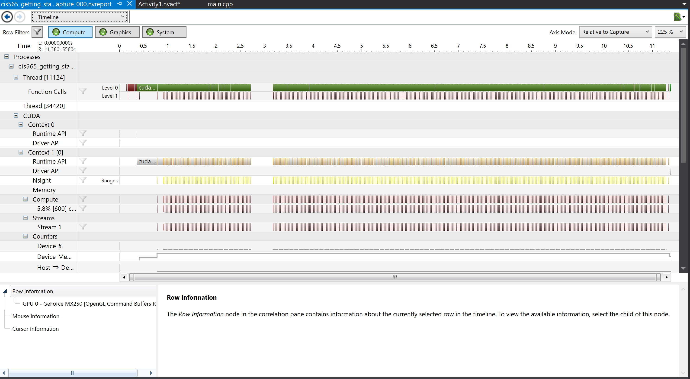
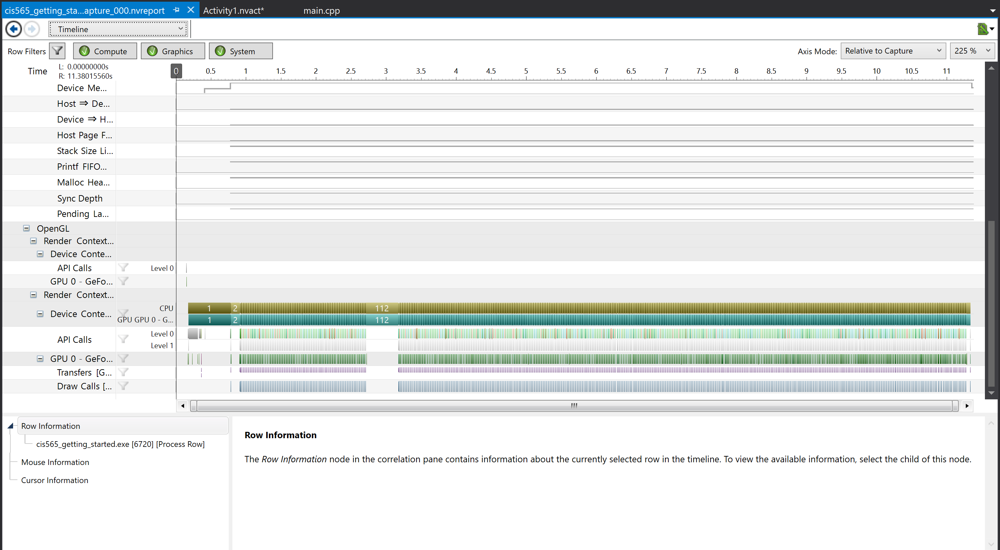
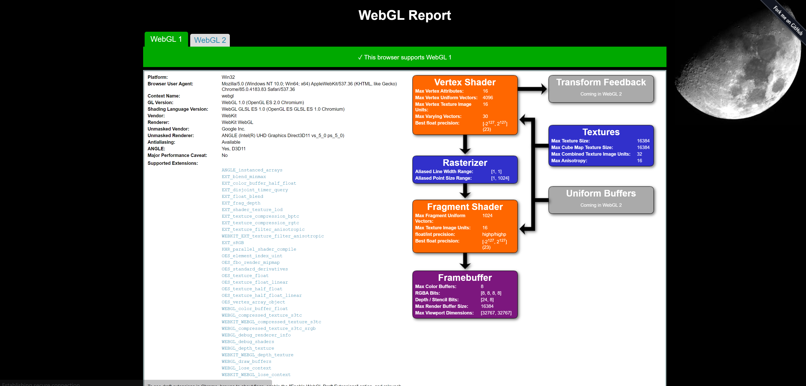
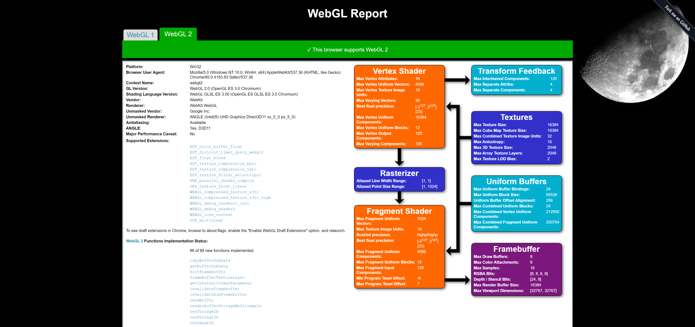
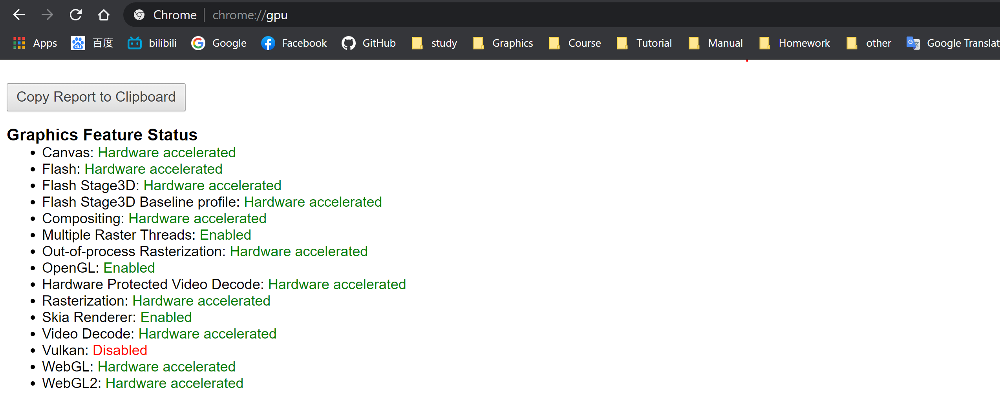
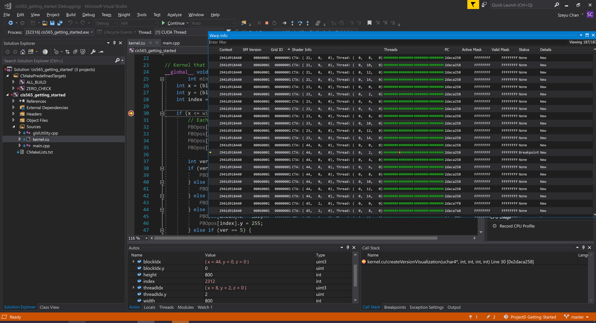
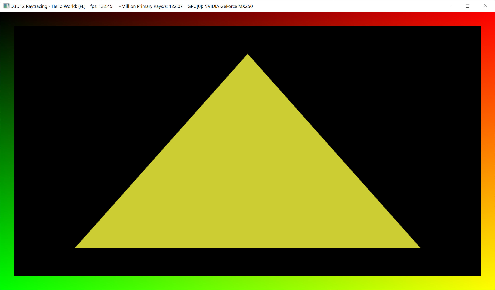

Project 0 Getting Started
====================

**University of Pennsylvania, CIS 565: GPU Programming and Architecture, Project 0**

* Szeyu Chan
  * [LinkedIn](https://www.linkedin.com/in/szeyuchan11/)
* Tested on: Windows 10, i7-10510U @ 1.80GHz 16GB, MX250 2048MB (Personal Laptop)

### Screenshots

