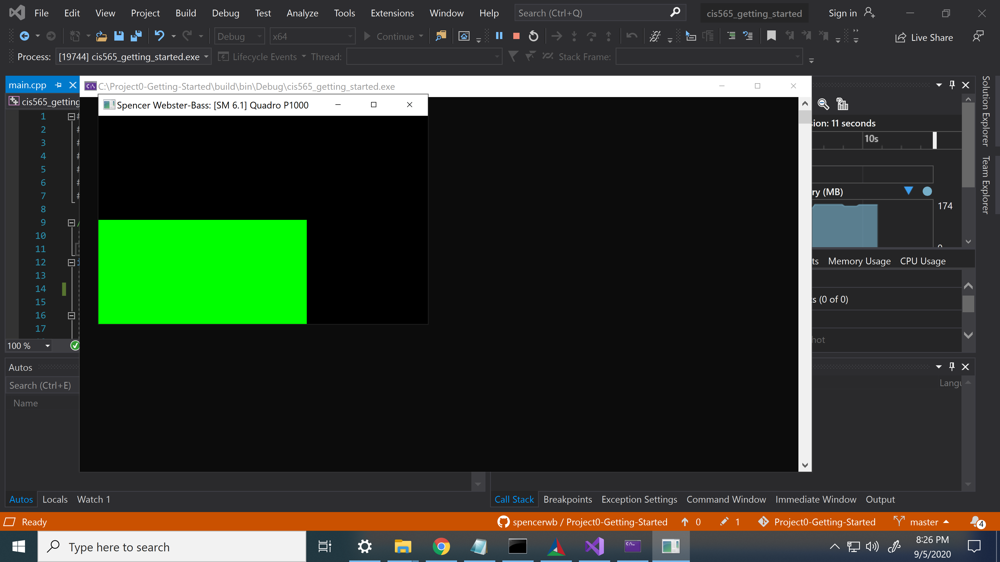
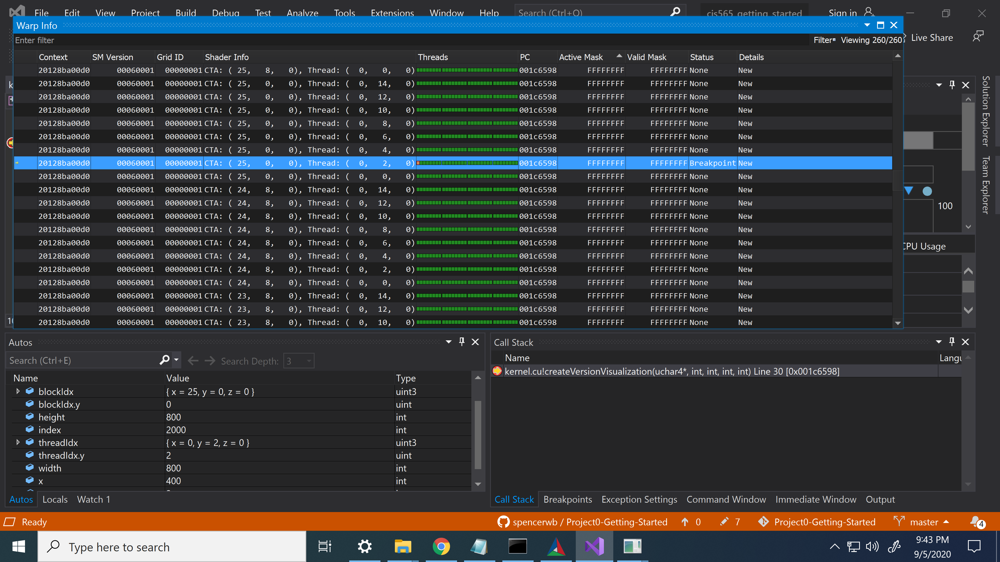

Project 0 Getting Started
====================

**University of Pennsylvania, CIS 565: GPU Programming and Architecture, Project 0**

* Spencer Webster-Bass
  * https://www.linkedin.com/in/spencer-webster-bass/
* Tested on: MOR100C-13 (CETS Virtual Machine)

**Part 3.1: CUDA**

My GPU: Quadro P1000
My GPU's CUDA-Compatability: 6.1

**Part 3.1.1: Modify the CUDA Project**

**Part 3.1.2: Analyze**

**Part 3.1.3: Nsight Debugging**

**Part 3.2: WebGL**

**Part 3.3: DXR**

My computer does not have any level of RTX support.
I am using a CETS computer and thus cannot complete part 3.3 for identifying the level of DXR support.

