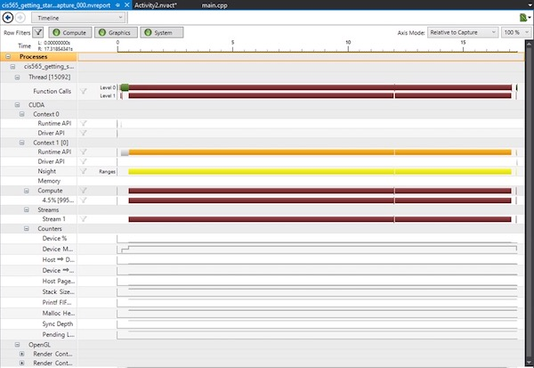
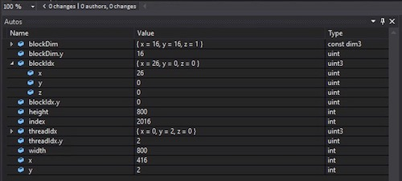
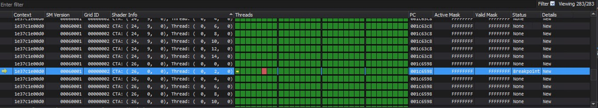
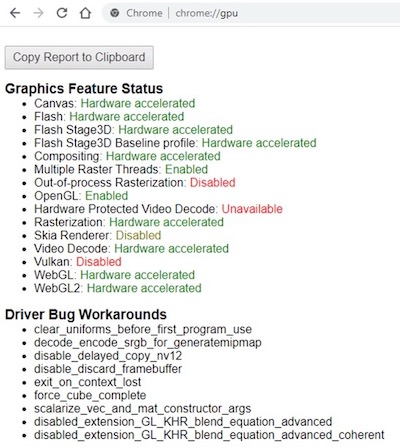

Project 0 Getting Started
====================

** University of Pennsylvania, CIS 565: GPU Programming and Architecture, Project 0 **

* Alice Bian
  * [LinkedIn](www.linkedin.com/in/alice-bian), [personal website](https://www.alice-bian.com/portfolio)
* Tested on: Windows 10 (Remote Desktop into CETS Virtual Lab)

### README

Include screenshots, analysis, etc. (Remember, this is public, so don't put
anything here that you don't want to share with the world.)

Part 3.1: Compute Capability of 6.1 (GPU Quadro P1000)

Part 3.1.1: Modified CUDA Project Titlebar
 

Part 3.1.2: Timeline
 

Part 3.1.3: 
 

Part 3.2: WebGL
 

Part 3.3: I am working on a CETS Virtual Lab, so I cannot enable Developer Mode without admin support.

