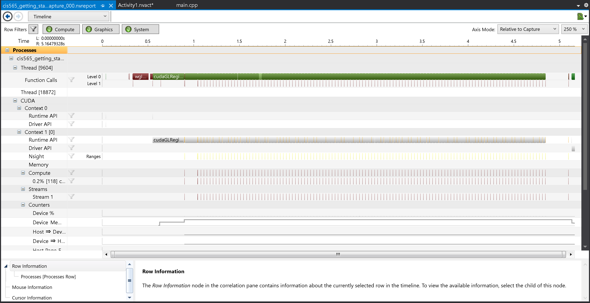
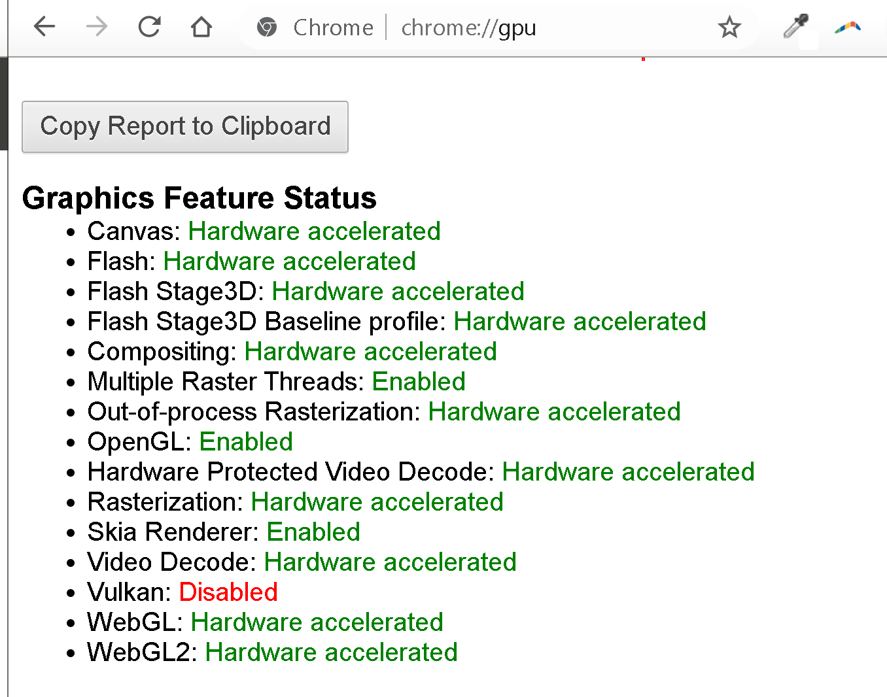

Project 0 Getting Started
====================

**University of Pennsylvania, CIS 565: GPU Programming and Architecture, Project 0**

NAME: CHETAN PARTIBAN \\
GPU: GTX 970m (Compute Capability 5.2) \\
Tested on Windows 10, i7-6700HQ @ 2.60 GHz 16Gb, GTX 970m 6Gb (Personal Laptop) \\
[LinkedIn](https://www.linkedin.com/in/chetan-parthiban)

### Screenshots

**3.1.1**

**3.1.2**

**3.1.3**

**3.2**

**3.3**

