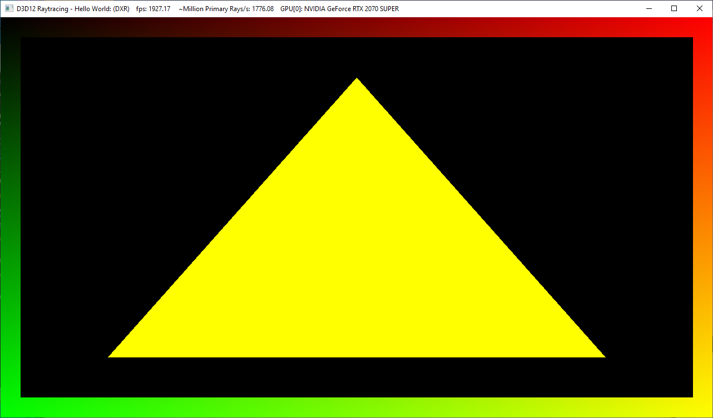

Project 0 Getting Started
====================

**University of Pennsylvania, CIS 565: GPU Programming and Architecture, Project 0**

* Jiarui Yan
  * [LinkedIn](https://www.linkedin.com/in/jiarui-yan-a06bb5197?lipi=urn%3Ali%3Apage%3Ad_flagship3_profile_view_base_contact_details%3BvRlITiOMSt%2B9Mgg6SZFKDQ%3D%3D), [personal website](https://jiaruiyan.pb.online/), [twitter](https://twitter.com/JerryYan1997), etc.
* Tested on: Windows 10 Home, i7-9700K @ 3.60GHz 16GB DDR4 RAM, RTX 2070 SUPER 8GB Dedicated GPU memory (Personal desktop)

### Part 2.1: CUDA capabilities
My Graphics card: RTX2070 SUPPER.

CUDA Compute Capability: 7.5

### Part 2.2: WebGL Chrome Screenshot

### Part 2.3: DXR

### Part 4: Modify

### Part 5: Analyze

### Part 6: Nsight Debugging

Autos window:

Warp:

