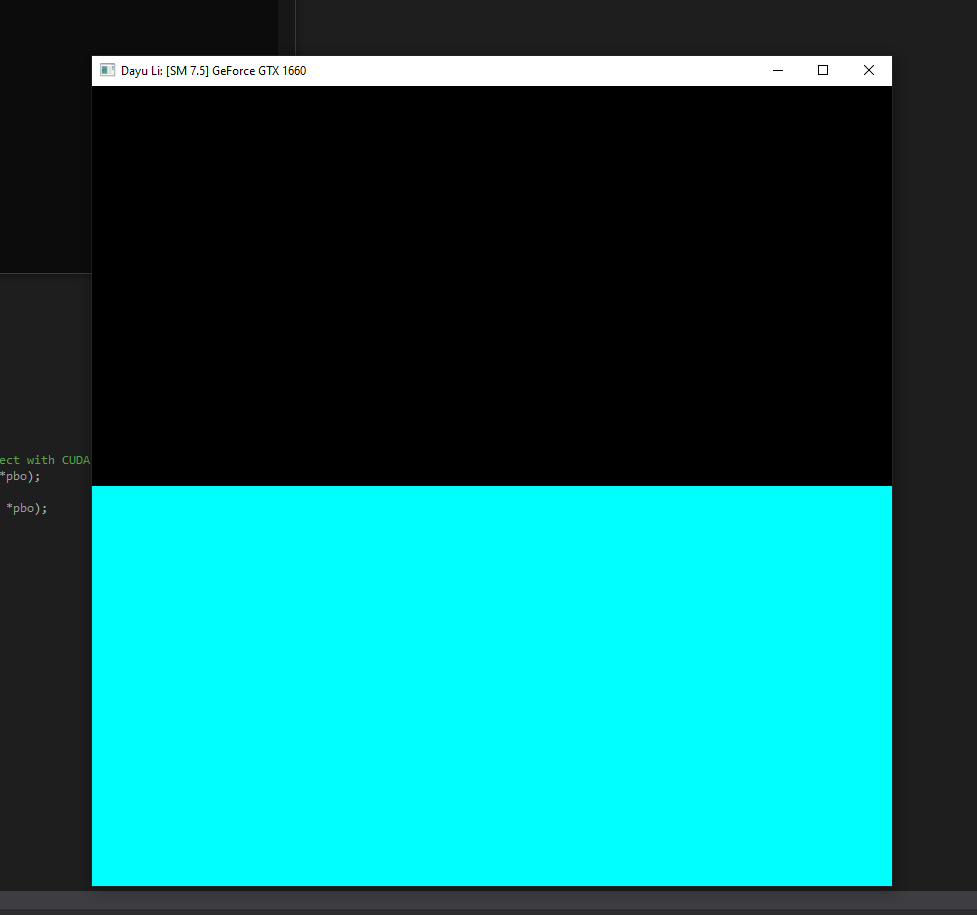

Project 0 Getting Started
====================

**University of Pennsylvania, CIS 565: GPU Programming and Architecture, Project 0**

* Dayu Li
  * [LinkedIn](https://www.linkedin.com/in/dayu95/)
* Tested on: Windows 10, i5-9400F @ 2.90GHz 8GB, GTX 1660 (Personal)

## Result:
* ### Screenshot from Part 3.1.1 for the CUDA demo program.

* ### Screenshot of the timeline from Part 3.1.2's Nsight System's performance analysis

* ### Screenshots of the validation for WebGL support from Part 3.2

* ### Screenshot of the Autos window and the Warp Info from Part 3.1.3's Nsight debugging

* ### Screenshot from Part 3.2 for DXR demo (`float3 barycentrics = float3(0.2, 0.4, 0.2);`)

