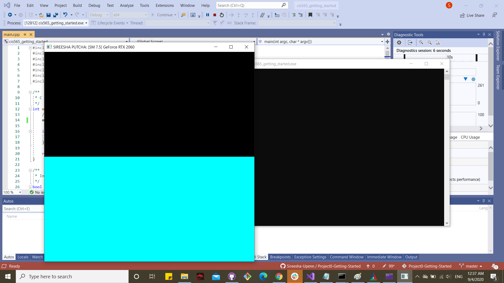
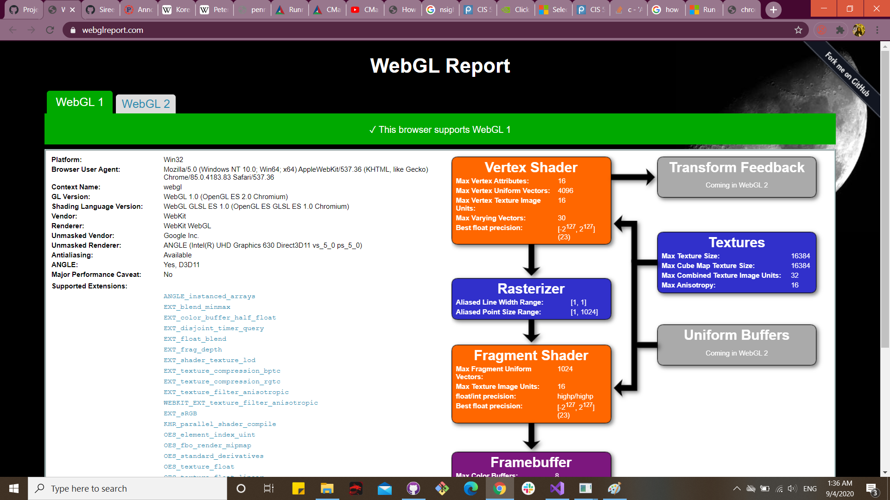

Project 0 Getting Started
====================

**University of Pennsylvania, CIS 565: GPU Programming and Architecture, Project 0**

## SIREESHA PUTCHA 

	
 &nbsp &nbsp &nbsp &nbsp &nbsp &nbsp  &nbsp &nbsp &nbsp &nbsp &nbsp &nbsp   

###  [LinkedIn](www.linkedin.com/in/sireesha-putcha) [Portfolio](https://sites.google.com/view/sireeshaputcha/home)  [Facebook](https://www.facebook.com/sireesha.putcha98/)

* Tested on: Microsoft Windows 10 Pro, Processor	Intel(R) Core(TM) i7-9750H CPU @ 2.60GHz, 2601 Mhz, 6 Core(s), 12 Logical Processor(s) NVIDIA GeForce RTX 2060

### 1) Part 3.1 - CUDA Project Test 

### 2) Part 3.1.2 Performance Analysis 

### 3) Part 3.1.3 NSight Debugging 

### 4) Part 3.2 WebGL Support 

### 5) Part 3.3 DXR 
 

