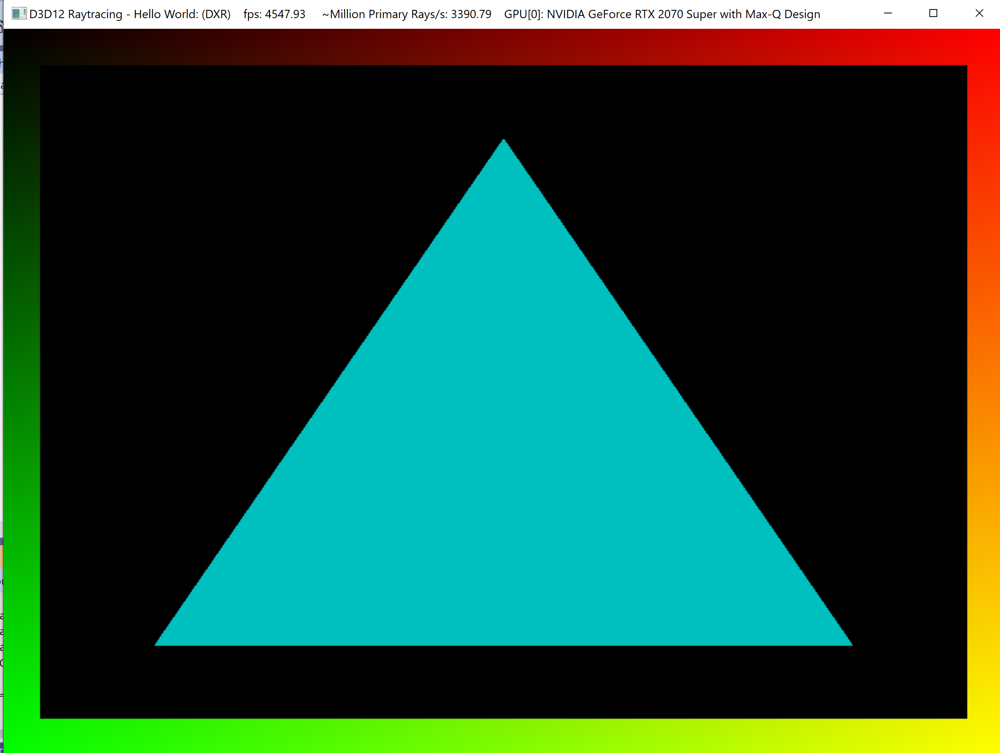

Project 0 Getting Started
====================

**University of Pennsylvania, CIS 565: GPU Programming and Architecture, Project 0**

* (TODO) YOUR NAME HERE
  * [LinkedIn](https://www.linkedin.com/in/haorong-henry-yang/)
* Tested on: (TODO) Windows 10 Home, i7-10750H @ 2.60GHz 16GB, GTX 2070 Super Max-Q (Personal)

Modifying main.cpp:

NSight Analysis:

NSight Debugging:

WebGL:

DXR:

