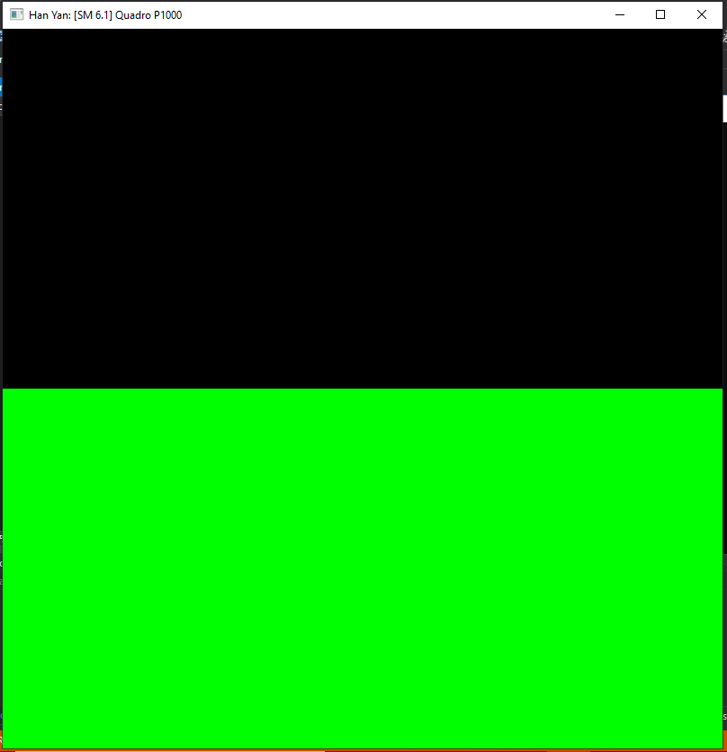

Project 0 Getting Started
====================

**University of Pennsylvania, CIS 565: GPU Programming and Architecture, Project 0**

* Han Yan
* Tested on: CETS Virtual Lab

### (TODO: Your README)

Include screenshots, analysis, etc. (Remember, this is public, so don't put
anything here that you don't want to share with the world.)

### Part 3.1 CUDA

### Part 3.2 WebGL

### Part 3.3 DXR

I was able to build but not run the solution on CETS virtual lab, as I could not enable Developer Mode

