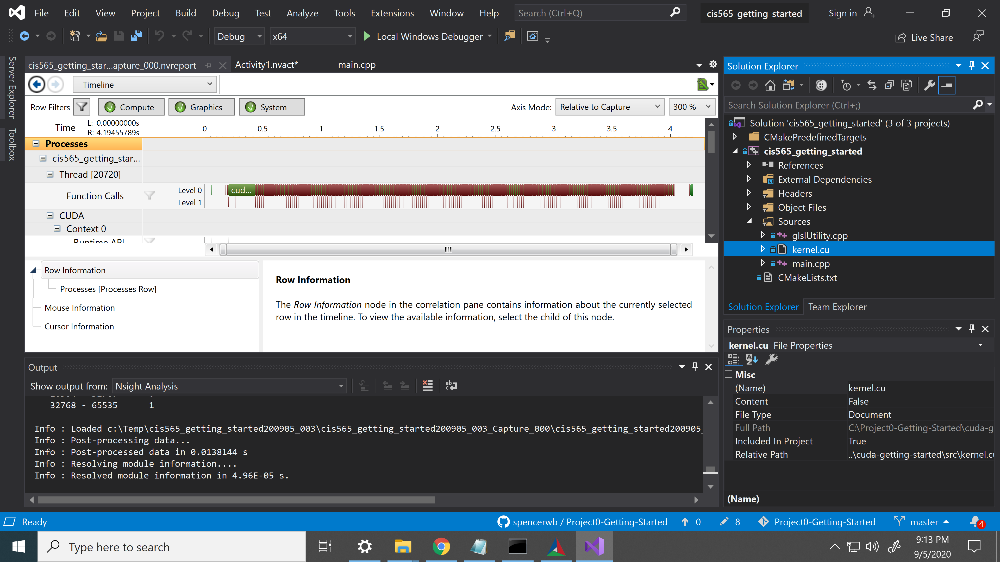

Project 0 Getting Started
====================

**University of Pennsylvania, CIS 565: GPU Programming and Architecture, Project 0**

* Janine Liu
  * [LinkedIn](https://www.linkedin.com/in/liujanine/), [personal website](https://www.janineliu.com/).
* Tested on: Windows 10, i7-10750H CPU @ 2.60GHz 16GB, GeForce RTX 2070 w/ total available graphics memory of 16303MB, dediated video memory 8192 MB (personal computer)

### 3.1.1: CUDA Project Screenshot

### 3.1.2: NSight Timeline

### 3.1.3: NSight Debugging (Autos & Warp Info)

### 3.2: WebGL Support

### 3.3: DXR Modified Triangle

