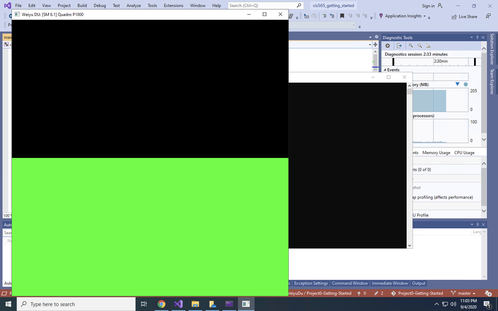

Project 0 Getting Started
====================

**University of Pennsylvania, CIS 565: GPU Programming and Architecture, Project 0**

* Weiyu Du
  * [LinkedIn](https://www.linkedin.com/in/weiyu-du/)
* Tested on: CETS virtual lab MOR100C-08, Intel(R) Core(TM) i7-9700 CPU @ 3.00GHz 

### README

### 3.1 CUDA

### 3.1 WebGL

